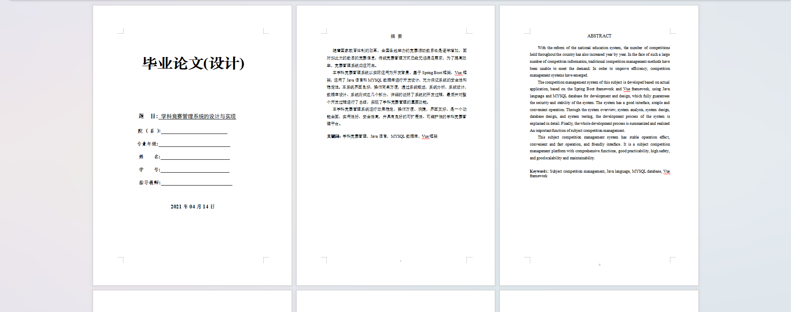
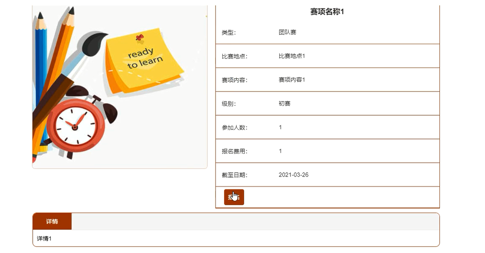
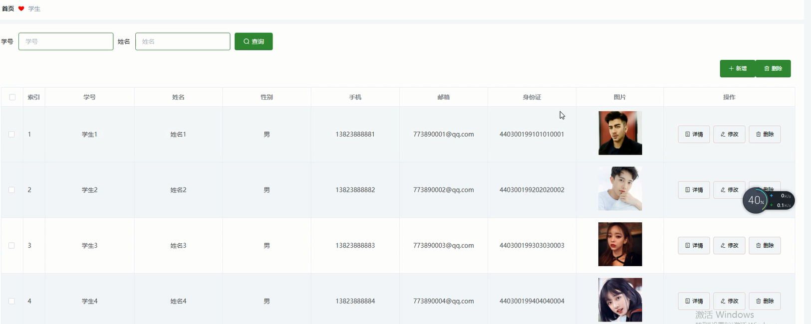
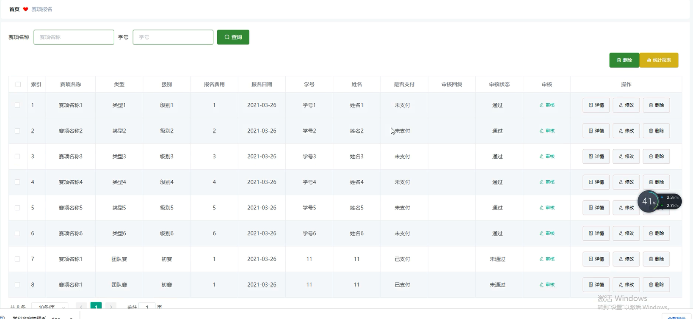

基于Springboot的学科竞赛管理（程序+论文）
=
### 完整代码获取地址：从戎源码网 ([https://armycodes.com/](https://armycodes.com/))
### 作者微信：19941326836  QQ：952045282 
### 承接计算机毕业设计、Java毕业设计、Python毕业设计、深度学习、机器学习
### 选题+开题报告+任务书+程序定制+安装调试+论文+答辩ppt 一条龙服务
### 所有选题地址https://github.com/nature924/allProject

一、项目介绍
---
系统包含两种角色：用户、管理员，系统分为前台和后台两大模块，主要功能如下：

### 1 学生功能模块的实现

系统主界面
学生进入系统后可查看系统信息，展示主界面。

学生注册界面
没有账号的学生用户可进行注册操作。

学生登录界面
学生在登录时需输入正确的登录用户名和密码，系统会验证登录信息，信息正确则登录成功，反之登录失败。

赛项详情界面
学生可选择赛项查看详情信息，登录后可进行报名操作，展示报名界面。

个人中心界面
学生可对个人信息进行修改。

### 2管理员功能模块的实现

管理员登录界面
管理员要进入后台进行管理操作，需先登录系统后台。

学生管理界面
管理员在学生管理界面可查看所有学生信息，并可进行修改和删除操作，同时也可添加学生信息。

教师管理界面
管理员可增删改查教师信息。

赛项信息管理界面
管理员可增删改查赛项信息。

赛项报名管理界面
管理员可查看所有赛项报名信息，并可对其进行审核、修改和删除操作。

奖项统计管理界面
管理员可增删改查奖项统计信息。

二、项目技术
---
- 编程语言：Java
- 数据库：MySQL
- 项目管理工具：Maven
- 前端技术：VUE、HTML、Jquery、Bootstrap
- 后端技术：Spring、SpringMVC、MyBatis

三、运行环境
---
- 操作系统：Windows、macOS都可以
- JDK版本：JDK1.8以上都可以
- 开发工具：IDEA、Ecplise、Myecplise都可以
- 数据库: MySQL5.7以上都可以
- Tomcat：任意版本都可以
- Maven：任意版本都可以

四、运行截图
---
### 论文截图：

### 程序截图：

